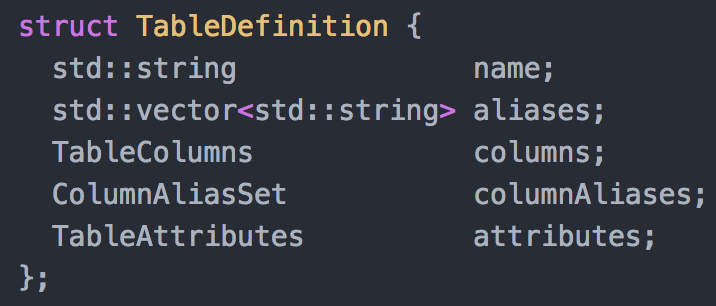
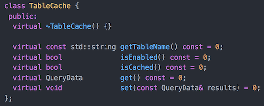
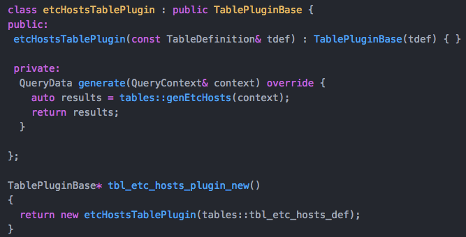

## Proposal: Alternative TablePlugin linkage

### Goals

The goals of this refactoring are:
 1. Simplify the TablePlugin class, hiding the table cache, table definition.
 2. Simplify table linkage.  Move TablePlugin creation to the table implementation files.
 3. Take advantage of code generation to provide table specific structs to make implementation code cleaner.

### Background

The current osquery build system linkage to table implementations can be summarized as follows:
 - There are 4 "categories" of table linkages: **utils** (part of libosquery), **additional** (available), **foreign** (empty), and **blacklisted** (not available).
 - A .cpp file is generated for each spec file and placed in appropriate subdirectory of build/platform/generated/tables_CATEGORY
 - A CATEGORY_amalgamation.cpp file is built from the bodies of the generated .cpp files in the corresponding tables_CATEGORY subdirectory.
 - The utils and additional amalgamations have TablePlugin class declarations which refer to the generator, generate, or event_subscriber symbol defined in table .spec files.  The TablePlugins also have code to use a table cache for tables that have CACHEABLE attribute.
 - The foreign amalgamations have TablePlugin class declarations that return empty results, and are only registered if registerForeignTables() is called (such as when --foreign cmdline flag is present).

### Implemented Changes
1. Added a TableDefinition struct that encapsulates table .spec definition in [tables.h](https://github.com/packetzero/osquery/blob/alt_table_linkage_m/include/osquery/tables.h) .


2. Added a TableCache interface abstraction in tables.h.  Existing table cache behavior that was split between core code and generated TablePlugin declarations in the amalgamations are now in TableCacheDB class [osquery/database/tablecachedb.cpp](https://github.com/packetzero/osquery/blob/alt_table_linkage_m/osquery/database/tablecachedb.cpp).



3. The code generation now create a header file for each table spec, rather than a .cpp file.  The header is called tbl_TABLENAME_defs.hpp and contains the following parts, each requiring a unique compile to be defined.  For example, if the table is named **disk_events**, then defining DECLARE_TABLE_DEF_disk_events,  DECLARE_TABLE_IMPLEMENTATION_disk_events, or DECLARE_TABLE_FOREIGN_STUB_disk_events before including the header file will cause the appropriate pieces of generated code to be included.

 **TableDefinition**

 Previously, the amalgamation would declare each part using TablePlugin members columns(), columnAliases(), aliases(), attributes().  The table definition is now a self-contained struct that also includes the name.  .

 **table plugin stub**

 This the table definition and TablePluginBase instance that returns empty results.

 **default table plugin declaration**

 Table implementations now need to implement a function like *tbl_xx_plugin_new()* that returns an instance of the table plugin.  For convenience, all that is needed is to include the generated header file and declare a macro flag.  This will declare the table plugin instance that calls the right generate, generator, or event_subscriber function, as was previously done in the amalgamation file.  For example, [osquery/tables/system/windows/autoexec.cpp]():
 ```
#define DECLARE_TABLE_IMPLEMENTATION_autoexec
#include <generated/tables/tbl_autoexec_defs.hpp>
 ```

 **table-specific struct**

 Provided for optional convenience to implementation code.  Consider code in [genProcesses() of processes.cpp](https://github.com/packetzero/osquery/blob/437429054e33a3ebd39069a05b711d0dad6e42fc/osquery/tables/system/darwin/processes.cpp#L274), which  contains assignments like `r["pid"]=INTEGER(pid);`.  Those assignments can now be standard typed assignments like `row.pid=pid;`, where row is a tbl_processes_t struct defined in the generated .hpp file.  Before adding the row to the results list, call `row.toHashmap(r)` which will convert to the standard string map, automatically providing the lexical casts.

4. Created a TablePluginBase class as the basis for all implementation classes.  The TablePlugin class remains for source-code compatibility, and is a subclass of TablePluginBase.  Consider the code generated for table **etc_hosts**, which gets included in *osquery/tables/networking/etc_hosts.cpp* when DECLARE_TABLE_IMPLEMENTATION_etc_hosts is defined. The table definiton:


The TablePluginBase subclass and factory function. Notice that the table definition is passed to the TablePluginBase constructor.  The subclass only needs to implement the data function (e.g. generate()).  The TablePluginBase will take a look at the TableDefinition and allocate persistent table cache if CACHEABLE attribute is set.  A plugin that is not part of the osquery source tree could manually declare the table definition and TablePluginBase subclass just as effectively.




### Behind the Scenes

Since the utils and additional amalgamations now call tbl_TABLENAME_plugin_new() to get an instance, I had to add a new REGISTER_OBJ() macro that takes an TablePluginBase instance, rather than using the REGISTER() macro, which was doing the allocation.

Functions setRequestFromContext() and setContextFromRequest() were removed from tables.h and are local to sql/sql.cpp and core/tables.cpp.

### Future Optimization Advantages
1. Table .spec files no longer need to include **implementation** declarations.  Linkage symbol is tbl_TABLENAME_plugin_new().
2. Now that the generated header files are available to implementation code, it would be possible to optimize generate/generator return value (call it QueryResultsV2) to not include column names for each row.  QueryResultsV2 could be `std::vector<std::map<uint32_t,std::string>>`, where the uint32_t is the index of the TableDefinition.columns[].  Alternatively, QueryResultsV2 could be `std::vector<std::vector<std::string>>` if no column values are skipped. If code uses the generated table struct (e.g. tbl_etc_hosts_data_t), the toHashmap() conversion function would take of the details.
