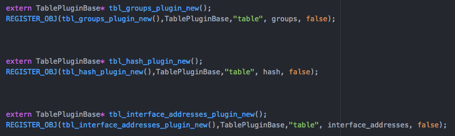
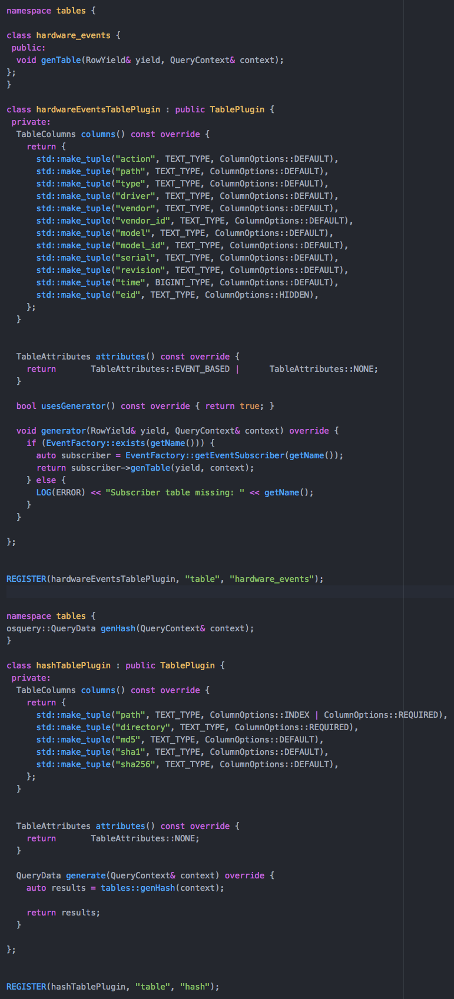

## Comparison of additional_amalgamation
The main difference is that the declaration of the table plugin subclass (and it's allocation) is now the responsibility of the implementation file in *osquery/tables/* directory.

### Proposed implementation

### Existing implementation

