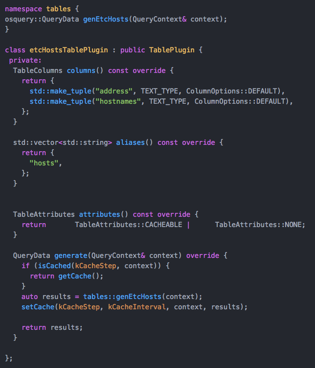

## Compare Table Plugin Declarations

## Existing
Note the generated code has logic for cache, including references to global constants.

## Proposed
The main difference is that the plugin is now a subclass of TablePluginBase, rather than TablePlugin.  The TableDefinition is self-contained, and passed to the constructor.  The table cache is handled behind the scenes by TablePluginBase.  So it's the same functionality, organized in a different manner.

