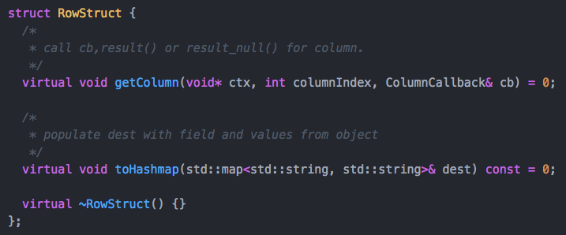
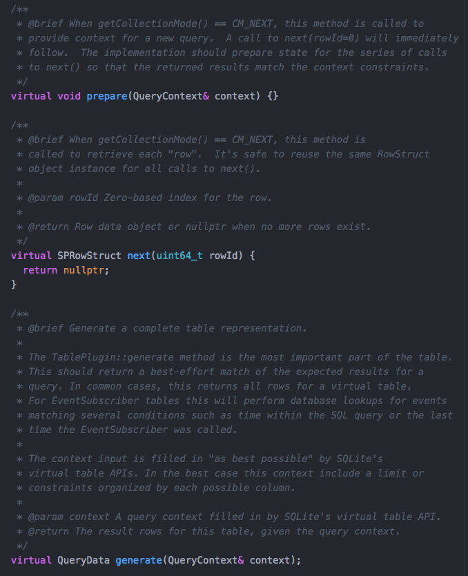
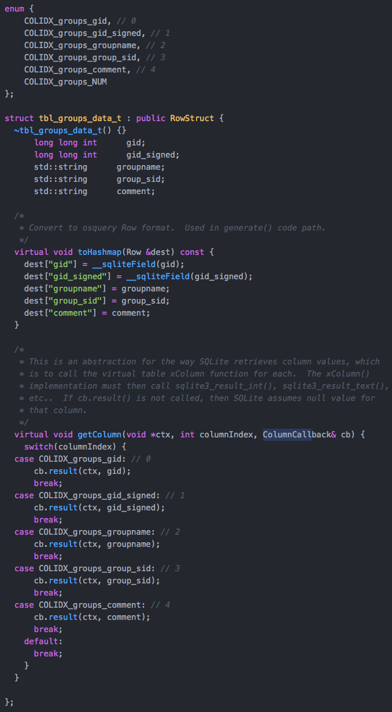

## Proposal : Efficient Typed Rows

This is for the [typed_rows branch](https://github.com/packetzero/osquery/commits/typed_rows), which builds upon the [alt-table-linkage](../osquery_alt_table_linkage/README.md) proposal.

### Background

There are currently two ways to implement table plugins in osquery (for non event_subscriber tables).  One can override **generate()** and return the entire result set in a QueryData, or override the **generator()** method to use asynchronous co-routines.

The generate() approach is the most common, and is the easiest to implement.  It has the disadvantage of requiring enough memory to store the entire QueryData result set in memory.

The generator() approach requires about 5% more CPU overhead, and since each row is reported separately, the table cannot be cached.

Since both approaches use the Row (string - string map) for the basic datatype,
column names are copied into each row, and all of the data values are converted to strings.  Those string values are then converted back into their native data types when handing them off to SQLite.

### A third approach

If we succumb to SQLite's way of doing things, and implement table plugins with **prepare(context)** and **next()** methods, and take advantage of code-generation for table row data structures, then we can achieve the following:
 - Support single row approach without the need for asynchronous coroutines
 - Seamless support for generate() behind the scenes
 - For cached tables, use generate() fallback
 - Avoid column name in results returned from next()
 - Avoid data type marshalling to and from string

**NOTE: Currently, the data struct approach does not support NULL column values**

### SQLite behavior

We know that SQLite will do the following for virtual tables (in pseudo code):
```
  virtualTable.xFilter(context);

  while (!virtualTable.xEof()) {

    if (virtualTable.xNext()) {

      for (column : virtualTable.columns) {

        virtualTable.xColumn(columnIndex);  // which will call sqlite3_result_TYPE(TYPE_value)

      }
    }
  }
```

### A new RowStruct interface
Consider the following interface.  We can use code-generation to generate structs that contain C++ typed fields for each column, with **getColumn()** and **toHashmap()**.  The toHashmap() is to convert to the standard QueryData returned from generate().  The getColumn() is an abstraction of SQLite virtual table's xColumn() function.



### New Table Plugin methods
This approach requires two new methods on TablePluginBase: prepare() and next().  The generate() method remains unchanged.  The prepare() method is analogous to the xFilter function of a virtual table.  Perhaps *prepare* is not the right name, as it may be confused with prepared statements, but I was not sure filter was the right name either.  I'm find with either name, or an alternative.
Actually, there's a third method as well called **getCollectionMethod()** which returns one of (CM_GENERATE, CM_GENERATOR, CM_NEXT), so we can distinguish between the 3 different ways to implement a table plugin.




### Example Code-Generated Definitions
Here is an example of the definitions generated for the "groups" table.  The table plugin implementation would populate and return an instance of tbl_groups_data_t.  The core osquery code will call getColumn() for each column that SQLite requests, which will result in the corresponding call to sqlite3_result_int(sqliteContext, intValue), etc.  As you can see, this allows us to code using structs and assignments such as `row.gid=0; row.groupname="wheel";`, and the typed field values are passed along to sqlite without the need to convert to and from strings.



### Automatic generate() fallback
The first table I implemented was processes on darwin.  When unit tests failed, I was reminded that processes table is special, in that it's used outside of the normal SQL code paths.  Monitoring code uses it to fetch process details, and assumes that **generate()** exists.  By implemeting the following fallback in TablePluginBase, any table that uses the CM_NEXT approach can also be used with generate().  Additionally, since the table cache handling is now done in sql/virtual_table.cpp, the core osquery code can use generate() on a CM_NEXT table if CACHEABLE and cacheAllowed().

### Example table plugins using typed rows
- [process_open_sockets, process_open_files on Darwin](https://github.com/packetzero/osquery/blob/typed_rows/osquery/tables/system/darwin/process_open_descriptors.cpp)
- [launchd](https://github.com/packetzero/osquery/blob/typed_rows/osquery/tables/system/darwin/launchd.cpp)
- [homebrew_packages](https://github.com/packetzero/osquery/blob/typed_rows/osquery/tables/system/darwin/homebrew_packages.cpp)
