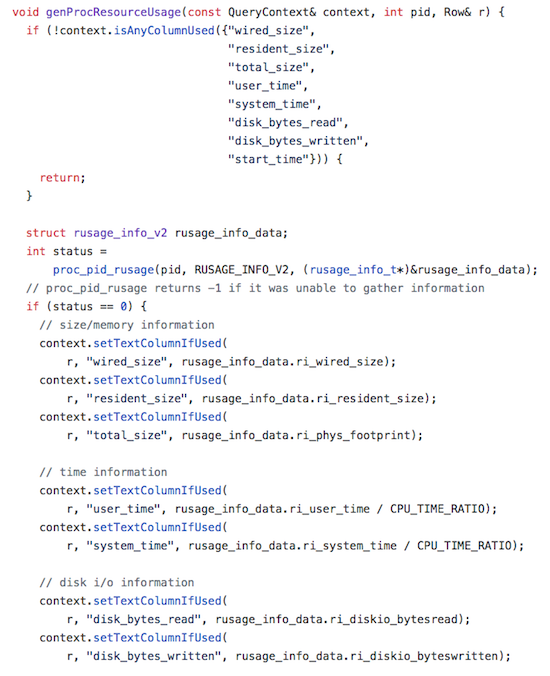
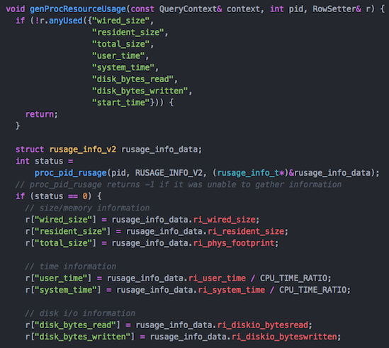
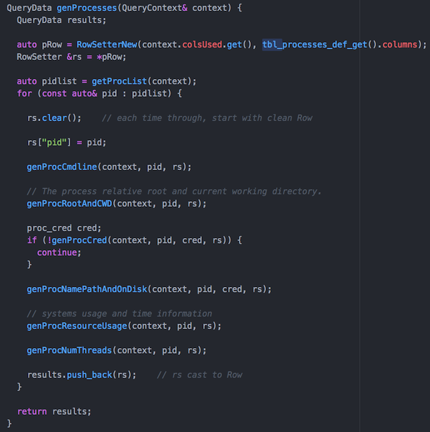

# Efficient Row Column Assignment

Recent changes in `tables/system/darwin/processes.cpp` indicate a desire to only set Row values for columns that have been requested in the query.  The schema tends to have wide tables, and by doing only setting requested columns will lead to less memory usage and cache data size on each individual query.

## Initial Implementation Using QueryContext

The implementation in the master branch has added several member functions to the QueryContext function, such as `setTextColumnIfUsed() and isAnyColumnUsed()`.

## Alternative Approach

By implementing an object that implements the subscript `[] operator`, we can create an object that can be used like Row (e.g. `std::map<std::string, std::string>`), but performs the checking under the covers.  Additionally, it can provide the marshaling of type to string using the `INTEGER()`, `BIGINT()`, etc. macros.  The table plugin code would then revert back to just setting values, where the Row is replaced with RowSetter.

**Benefits**

- **Little code change needed** Table plugins would need to create a RowSetter object and use that in place of Row.
- **Automatic type marshaling** Assigning a value like `row["num_packets"] = 29239944` will be able to detect the type and use `INTEGER()` or `BIGINT()` to serialize the column value to string, as does setIntColumnIfUsed().
- **QueryContext** Removes if-used functionality from the already complicated QueryContext class.

**Cons**

- **Requires TableColumns** This is available in the `alt_table_linkage_m` branch.  However, I am not sure there's a way to currently get it from the QueryContext.  May need to add a method to get this, if the alt_table_linkage never gets merged.

## Implementation

- [include/osquery/table_utils.h](https://github.com/packetzero/osquery/blob/typed_rows_struct2/include/osquery/table_utils.h)
- [osquery/core/table_utils.cpp](https://github.com/packetzero/osquery/blob/typed_rows_struct2/osquery/core/table_utils.cpp)
- [osquery/tables/system/darwin/processes.cpp](https://github.com/packetzero/osquery/blob/typed_rows_struct2/osquery/tables/system/darwin/processes.cpp)

## Create RowSetter

The big difference, is that the *generate* method for table plugin will need to create a RowSetter and use that in place of Row.  Additionally, for each row, it will need to call `clear()` method to start with a fresh row.  We need to use colsUsed on the context and column definitions.

## Possible Migration to Typed Rows

Part of my motivation for this, was my implementation of [alt_table_linkage_m](../osquery_alt_table_linkage/) and [typed_rows](../osquery_typed_rows/).  However, until seeing the columnsUsed code, I hadn't considered such requirements.  This forced me to take another look at the generated structs for each table schema, and make it work with those requirements.  Using this RowChecker, RowSetter interfaces will make it possible to share the code between the generated structs and Row.
